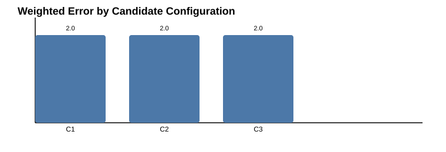

# Weight and Threshold Calibration

## Purpose

This calibration process treats the initial trust weights as hypotheses, not final truths. The objective is to estimate which candidate weight configurations and decision thresholds perform best on validation experiments before the final holdout experiment set is used for validation.

The design intentionally separates:

- validation experiments for tuning
- holdout experiments for final, untouched evaluation
- production policy and hard safety checks

This prevents overfitting to the final evaluation dataset.

## Core Principles

1. Initial weights are assumptions.
   - The prototype weights are a starting point.
   - They reflect a practical design hypothesis, not universal truth.
   - They should be reconsidered with empirical evidence, domain policy, and observed outcomes.

2. Validation experiments are for calibration only.
   - They are used to compare candidate configurations.
   - The final holdout experiment set must never be used for tuning.

3. Hard safety and policy are not optional.
   - Hard safety failures block decision-making regardless of trust score.
   - Policy approval is also required.
   - Trust score is one input, not the only decision factor.

4. Business costs matter.
   - False negatives and false positives are not equally costly.
   - Example business costs used in calibration:
     - false negative = 10
     - false positive = 2

## Prototype Weight Configuration

The initial prototype uses:

- DQ = 0.20
- DH = 0.20
- US = 0.30
- RS = 0.15
- PS = 0.15

This sums to 1.0.

Formula:

T = 0.20 × DQ + 0.20 × DH + 0.30 × US + 0.15 × RS + 0.15 × PS

## Validation Experiments

The calibration module generates controlled validation scenarios for candidate configuration selection. These scenarios include:

- accepted participants with high quality and stability
- acceptable-but-marginal participants
- good participants with low confidence
- unsafe updates blocked by hard safety
- policy-blocked scenarios
- poor participants with weak reliability and poor performance

These are for tuning and model selection only.

## Holdout Experiments

The holdout set is separate and intentionally untouched during tuning. It is used only after the best configuration is chosen.

This ensures the final evaluation is not biased by tuning on the same data.

## Metrics Computed

For each candidate weight configuration and threshold evaluation, the system computes:

- TP
- TN
- FP
- FN
- Precision
- Recall
- F1
- False Positive Rate
- False Negative Rate
- Weighted error

Weighted error is calculated as:

weighted_error = (FN × false_negative_cost) + (FP × false_positive_cost)

With the default business costs:

- false_negative = 10
- false_positive = 2

## Example Business-Cost Scenario

If a bad participant is incorrectly trusted, the cost may be far higher than a harmless false alarm. Therefore the calibration process will prefer a configuration that minimizes the weighted business penalty, not only raw accuracy.

## Threshold Calibration

Decision thresholds are evaluated using the same validation scenarios. This allows the system to choose a threshold that balances:

- precision
- recall
- F1
- weighted error
- operational risk

The threshold search is separate from the final holdout evaluation.

## Stored Calibration Records

Each calibration run stores:

- configuration
- experiment name
- metrics
- selection reason
- timestamp

This makes it auditable and allows later review of why a configuration was selected.

## Actual Generated Chart

The calibration module produces a chart from actual experiment results and stores it under the docs chart output directory.

See generated artifact:

- docs/charts/calibration_results.svg

## Chart

## Implementation Notes

A calibration entry includes:

- candidate weight set
- validation scenario set
- threshold selected
- metric summary
- selection reason
- timestamp

The code is implemented in:

- src/calibration.py

It supports:

- generating validation scenarios
- evaluating candidate weights
- evaluating thresholds
- selecting the best candidate by weighted error and F1 tradeoff
- exporting calibration chart artifacts

## Why This Matters

The trust model is a decision aid, not an absolute truth source. The calibration process is necessary because:

- weights are hypotheses
- threshold choices can materially change decisions
- business costs are asymmetric
- final holdout evaluation must remain unbiased
- policy and hard safety conditions must be enforced outside the trust score itself

## Final Note

Calibration is a disciplined, auditable process for choosing a good candidate configuration before deployment. It deliberately avoids tuning on the final holdout set and records why the chosen configuration was selected.
