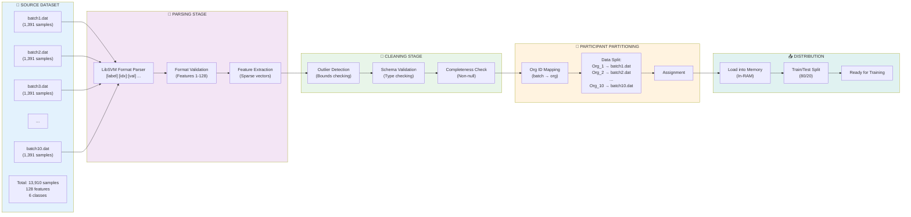
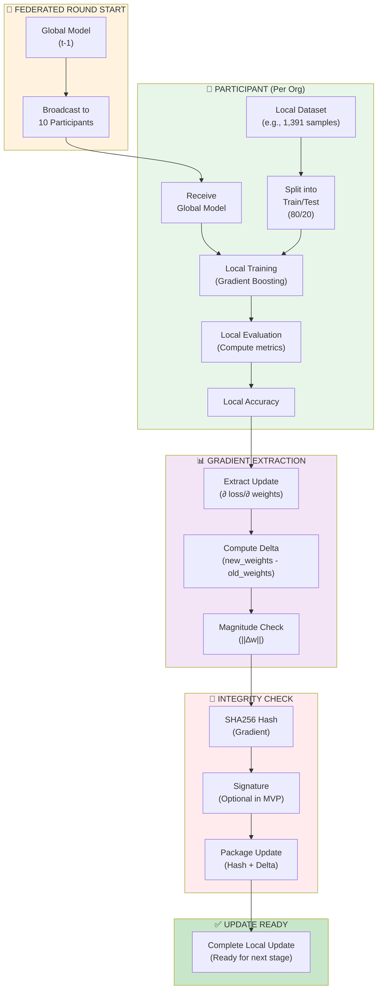
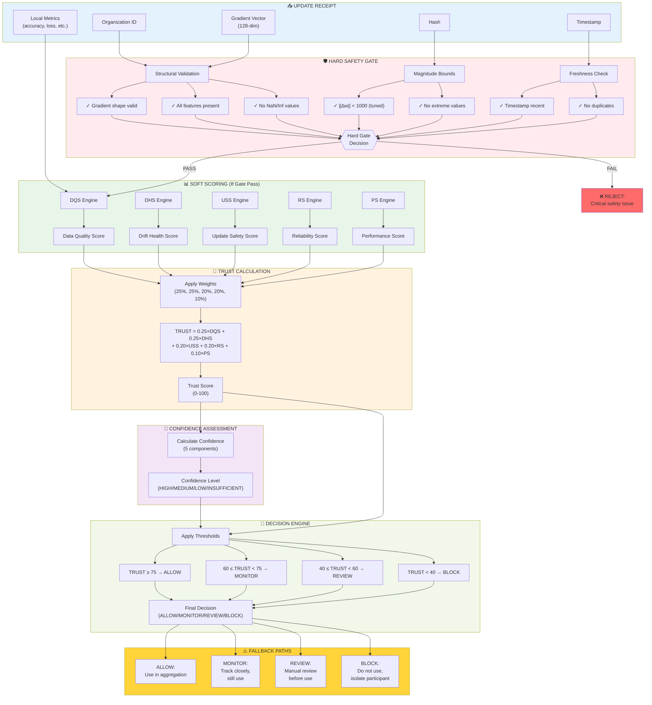
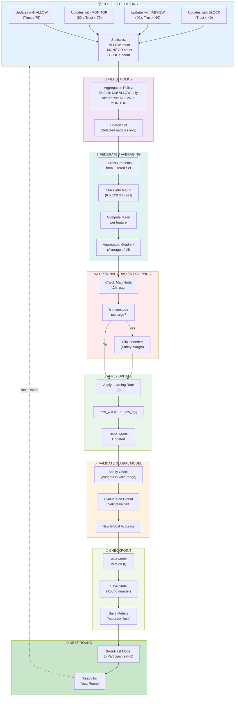

# Data Flow
## Protector Uttam: Data Pipeline Architecture

**Document Type:** Data Processing Reference  
**Version:** 1.0  
**Date:** 2024  
**Diagrams:** 4 detailed data flow views  

---

## 1. Dataset Flow: Raw to Distributed

Complete flow from raw dataset files through preprocessing to participant distribution:



---

## 2. Federated Training Flow

Complete flow of local training at each participant, from data to gradient extraction:



---

## 3. Detailed Update Flow: From Participant to Decision

Complete flow of a single participant's update through all validation stages:



---

## 4. Aggregation & Update Flow

Flow from accepted updates through aggregation to global model update:



---

## Data Format Specification

### LibSVM Format

Each line in dataset files (batch1.dat through batch10.dat):

```
[label] [feature_index]:[feature_value] [feature_index]:[feature_value] ...

Examples:
1 1:0.5 10:1.2 50:0.1 128:99.5
3 5:1.0 20:2.1 40:0.5
2 1:0.1 50:0.2 100:1.5 128:50.0
```

### Properties

```
Label Space:        {1, 2, 3, 4, 5, 6} (6-class multiclass)
Feature Space:      {1, 2, ..., 128}
Feature Values:     Continuous [0.1, 170000+]
Sparsity:           99.78%-99.97% (very sparse)
Total Samples:      13,910
Samples per File:   ~1,391
Features per Line:  1-40 features typically (out of 128)
```

---

## Participant Data Distribution

```
Participant Mapping:
┌──────────────────────────┬─────────────┬────────────┐
│ Organization ID          │ Batch File  │ Samples    │
├──────────────────────────┼─────────────┼────────────┤
│ Org_1                    │ batch1.dat  │ 1,391      │
│ Org_2                    │ batch2.dat  │ 1,391      │
│ Org_3                    │ batch3.dat  │ 1,391      │
│ Org_4                    │ batch4.dat  │ 1,391      │
│ Org_5                    │ batch5.dat  │ 1,391      │
│ Org_6                    │ batch6.dat  │ 1,391      │
│ Org_7                    │ batch7.dat  │ 1,391      │
│ Org_8                    │ batch8.dat  │ 1,391      │
│ Org_9                    │ batch9.dat  │ 1,391      │
│ Org_10                   │ batch10.dat │ 1,391      │
├──────────────────────────┼─────────────┼────────────┤
│ TOTAL                    │             │ 13,910     │
└──────────────────────────┴─────────────┴────────────┘
```

---

## Key Constraints

### Data Volume Constraints

```
Memory Usage per Round:
- Dataset loaded: 100 MB
- Per-participant models: ~10 MB each × 10 = 100 MB
- Gradient storage: ~1 MB each × 10 = 10 MB
- Global model: 10 MB
- Working memory: 180 MB

Total Peak: ~400 MB (well under 8 GB MVP requirement)
```

### Processing Order

1. **Sequential (MVP):** Participants trained one at a time (5 min/round)
2. **Parallel (Stage 3):** 4-8 participants in parallel (2 min/round)
3. **Async (Stage 4):** Participants respond when ready (30 sec target)

### Data Quality Expectations

```
Expected Properties:
- No missing values (sparse features naturally absent)
- Bounded values (checked by hard safety gate)
- Class distribution: Natural imbalance (feature not bug)
- Feature distribution: Sparse and bounded
- Outlier rate: <1% (detected and reported)
```

---

## Document History

| Version | Date | Author | Notes |
|---------|------|--------|-------|
| 1.0 | 2024 | Team | Initial data flow architecture |

**End of Data Flow**
