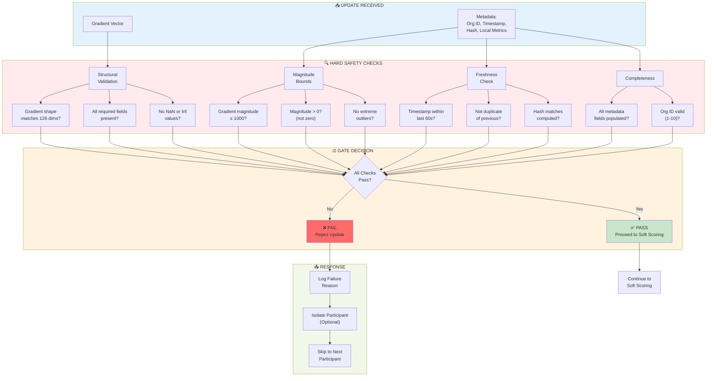
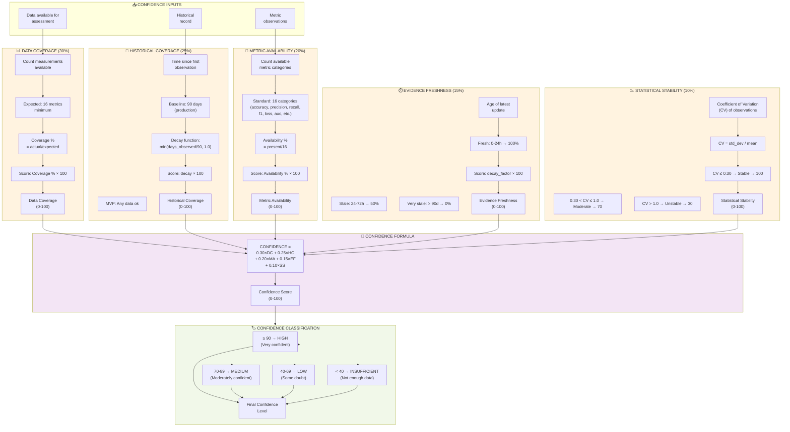
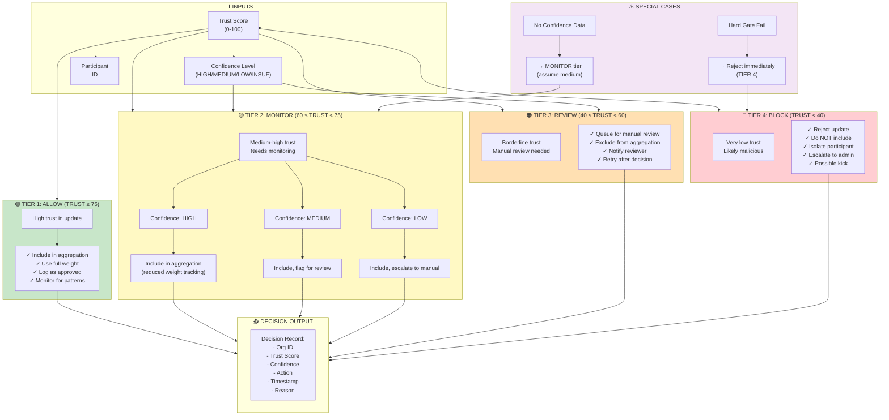
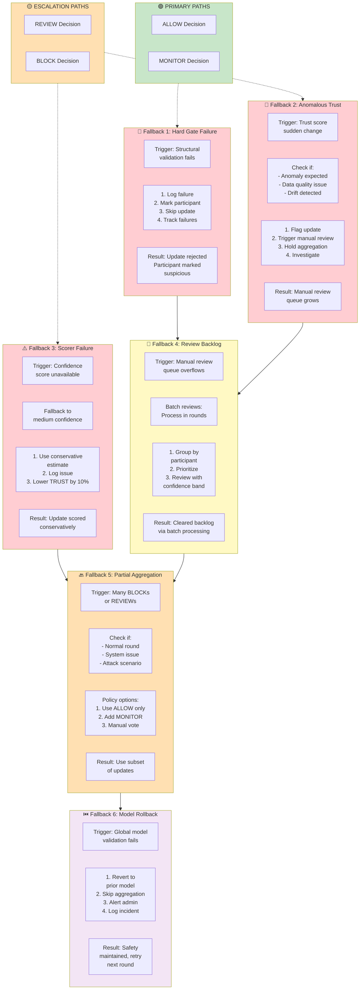
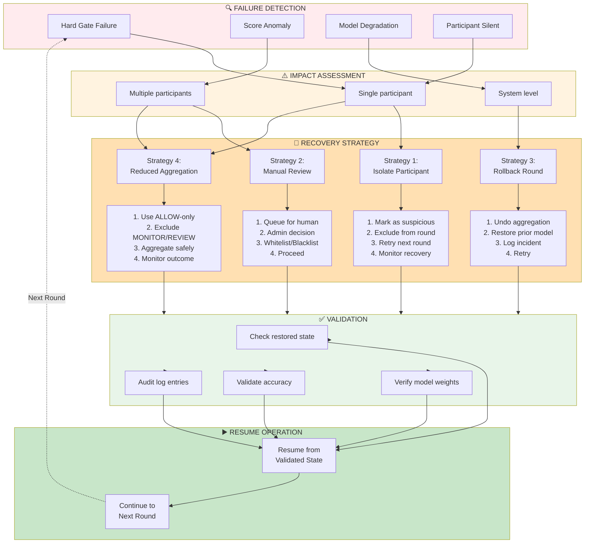

# Decision Flow
## Protector Uttam: Trust, Confidence & Decision Architecture

**Document Type:** Scoring & Decision Logic Reference  
**Version:** 1.0  
**Date:** 2024  
**Diagrams:** 7 detailed decision flow views  

---

## 1. Hard Safety Gate: Structural Validation

First line of defense - filters out structurally invalid updates:



---

## 2. Trust Score Calculation: Five Dimensions

Detailed calculation of the 5-component trust score:

```mermaid
graph TB
    subgraph ENGINE1["🏢 DATA QUALITY SCORE (DQS) - 25% Weight"]
        DQ_INPUT["Input: Raw data<br/>from participant"]
        
        DQS1["Schema Validation"]
        DQS1A["✓ All 128 features<br/>in valid range"]
        DQS1B["✓ Label in {1,2,3,4,5,6}"]
        DQS1C["✓ No NaN, Inf, null"]
        
        DQS2["Completeness Check"]
        DQS2A["✓ Non-empty dataset"]
        DQS2B["✓ Consistent format"]
        
        DQS3["Outlier Detection"]
        DQS3A["Outlier rate"]
        DQS3B["Score -= (outlier_pct)"]
        
        DQS_SCORE["DQS Result<br/>(0-100)"]
    end
    
    subgraph ENGINE2["📊 DRIFT HEALTH SCORE (DHS) - 25% Weight"]
        DH_INPUT["Input: Feature<br/>distributions"]
        
        DHS1["Population Stability<br/>Index (PSI)"]
        DHS1A["Compare participant<br/>distribution to"]
        DHS1B["global distribution"]
        
        DHS2["Calculate PSI"]
        DHS2A["PSI = Σ (exp_pct - obs_pct)<br/>× ln(exp_pct/obs_pct)"]
        DHS2B["Per feature"]
        
        DHS3["PSI Thresholds"]
        DHS3A["PSI < 0.1 → No drift<br/>Score = 100"]
        DHS3B["0.1 ≤ PSI < 0.25 → Minor<br/>Score = 80"]
        DHS3C["PSI ≥ 0.25 → Major<br/>Score = 40"]
        
        DHS_SCORE["DHS Result<br/>(0-100)"]
    end
    
    subgraph ENGINE3["🔄 UPDATE SAFETY SCORE (USS) - 20% Weight"]
        US_INPUT["Input: Gradient<br/>vector"]
        
        USS1["Gradient Validity"]
        USS1A["All values finite"]
        USS1B["Magnitude reasonable"]
        USS1C["No infinite loops in<br/>training"]
        
        USS2["Magnitude Analysis"]
        USS2A["||∆w|| in (0, 1000]"]
        USS2B["Not zero gradient"]
        USS2C["Not explosion"]
        
        USS3["Freshness"]
        USS3A["Gradient < 60s old"]
        USS3B["Recent round number"]
        
        USS_SCORE["USS Result<br/>(0-100)"]
    end
    
    subgraph ENGINE4["💓 RELIABILITY SCORE (RS) - 20% Weight"]
        RE_INPUT["Input: Participant<br/>history"]
        
        RS1["Availability"]
        RS1A["Heartbeat recent<br/>(last 5 rounds)"]
        RS1B["Success rate > 90%"]
        
        RS2["Consistency"]
        RS2A["No missed rounds<br/>recently"]
        RS2B["Updates on schedule"]
        
        RS3["Stability"]
        RS3A["Metric variance<br/>acceptable"]
        RS3B["No erratic behavior"]
        
        RS_SCORE["RS Result<br/>(0-100)"]
    end
    
    subgraph ENGINE5["🎯 PERFORMANCE SCORE (PS) - 10% Weight"]
        PE_INPUT["Input: Model<br/>performance"]
        
        PS1["Accuracy Check"]
        PS1A["Local accuracy<br/>≥ baseline"]
        PS1B["Not degrading"]
        
        PS2["Fairness Metrics"]
        PS2A["Per-class performance<br/>balanced"]
        PS2B["No class collapse"]
        
        PS3["Model Delta"]
        PS3A["Model improvement<br/>or stable"]
        PS3B["Not catastrophic<br/>degradation"]
        
        PS_SCORE["PS Result<br/>(0-100)"]
    end
    
    subgraph COMBINE["📊 COMBINE ALL SCORES"]
        FORMULA["TRUST = <br/>0.25×DQS +<br/>0.25×DHS +<br/>0.20×USS +<br/>0.20×RS +<br/>0.10×PS"]
        FINAL["Final Trust Score<br/>(0-100)"]
    end
    
    DQ_INPUT --> DQS1
    DQS1 --> DQS1A
    DQS1 --> DQS1B
    DQS1 --> DQS1C
    DQS1A --> DQS_SCORE
    DQS1B --> DQS_SCORE
    DQS1C --> DQS_SCORE
    DQS2 --> DQS_SCORE
    DQS3 --> DQS_SCORE
    
    DH_INPUT --> DHS1
    DHS1 --> DHS1A
    DHS1 --> DHS1B
    DHS1A --> DHS2
    DHS1B --> DHS2
    DHS2 --> DHS2A
    DHS2A --> DHS3
    DHS3 --> DHS3A
    DHS3 --> DHS3B
    DHS3 --> DHS3C
    DHS3A --> DHS_SCORE
    
    US_INPUT --> USS1
    USS1 --> USS1A
    USS2 --> USS_SCORE
    USS3 --> USS_SCORE
    
    RE_INPUT --> RS1
    RS1 --> RS1A
    RS2 --> RS_SCORE
    RS3 --> RS_SCORE
    
    PE_INPUT --> PS1
    PS1 --> PS1A
    PS2 --> PS_SCORE
    PS3 --> PS_SCORE
    
    DQS_SCORE --> FORMULA
    DHS_SCORE --> FORMULA
    USS_SCORE --> FORMULA
    RS_SCORE --> FORMULA
    PS_SCORE --> FORMULA
    FORMULA --> FINAL
    
    style ENGINE1 fill:#e8f5e9
    style ENGINE2 fill:#e8f5e9
    style ENGINE3 fill:#e8f5e9
    style ENGINE4 fill:#e8f5e9
    style ENGINE5 fill:#e8f5e9
    style COMBINE fill:#fff3e0
```



---

## 3. Confidence Assessment: Five Components

Detailed calculation of confidence in the trust score:



---

## 4. Decision Engine: Trust to Action

Maps trust score to decision with confidence guidance:



---

## 5. Fallback Mechanisms

Recovery paths when updates don't meet safety criteria:



---

## 6. Recovery Mechanisms

System recovery from failures:



---

## 7. Complete Decision Flow: Update to Action

End-to-end decision flow showing all states and transitions:

```mermaid
graph LR
    START["Start:<br/>Update Received"] --> GATE["Hard<br/>Safety Gate"]
    
    GATE -->|FAIL| REJECT["❌ REJECT<br/>Update"]
    GATE -->|PASS| DQS_ENG["DQS<br/>Engine"]
    
    DQS_ENG --> DHS_ENG["DHS<br/>Engine"]
    DHS_ENG --> USS_ENG["USS<br/>Engine"]
    USS_ENG --> RS_ENG["RS<br/>Engine"]
    RS_ENG --> PS_ENG["PS<br/>Engine"]
    
    PS_ENG --> TRUST_CALC["Trust<br/>Calculation"]
    TRUST_CALC --> CONF_CALC["Confidence<br/>Calculation"]
    
    CONF_CALC --> DECISION["Decision<br/>Engine"]
    
    DECISION -->|TRUST ≥ 75| ALLOW["🟢 ALLOW<br/>(Include)"]
    DECISION -->|60 ≤ TRUST < 75| MONITOR["🟡 MONITOR<br/>(Track)"]
    DECISION -->|40 ≤ TRUST < 60| REVIEW["🟠 REVIEW<br/>(Manual)"]
    DECISION -->|TRUST < 40| BLOCK["🔴 BLOCK<br/>(Reject)"]
    
    ALLOW --> AGGREGATE["Aggregation"]
    MONITOR --> CHECK_CONF{"Confidence<br/>High?"}
    CHECK_CONF -->|Yes| AGGREGATE
    CHECK_CONF -->|No| MANUAL["Manual<br/>Review"]
    
    REVIEW --> MANUAL
    MANUAL --> ADMIN_DECISION{"Approved?"}
    ADMIN_DECISION -->|Yes| AGGREGATE
    ADMIN_DECISION -->|No| REJECT
    
    BLOCK --> ISOLATE["Isolate<br/>Participant"]
    ISOLATE --> REJECT
    
    AGGREGATE --> UPDATE["Update<br/>Global Model"]
    REJECT --> SKIP["Skip to<br/>Next Round"]
    
    UPDATE --> NEXT["Ready for<br/>Next Round"]
    SKIP --> NEXT
    
    style START fill:#e3f2fd
    style GATE fill:#ffebee
    style ALLOW fill:#c8e6c9
    style MONITOR fill:#fff9c4
    style REVIEW fill:#ffe0b2
    style BLOCK fill:#ffcdd2
    style AGGREGATE fill:#e0f2f1
    style UPDATE fill:#e8f5e9
    style NEXT fill:#c8e6c9
    style REJECT fill:#ff6b6b
```



---

## Trust Score Reference Table

Quick reference for decision boundaries:

```
┌──────────────────┬────────────────┬───────────────────────────┐
│ Trust Score      │ Decision       │ Typical Action            │
├──────────────────┼────────────────┼───────────────────────────┤
│ 90-100           │ ALLOW          │ Include, high priority    │
│ 75-89            │ ALLOW          │ Include normally          │
│ 75               │ ALLOW/MONITOR  │ Borderline (HIGH conf OK) │
│ 60-74            │ MONITOR        │ Include with tracking     │
│ 40-59            │ REVIEW         │ Queue for manual review   │
│ 30-39            │ BLOCK (likely) │ Likely malicious          │
│ <30              │ BLOCK          │ Definitely malicious      │
│ <0 or >100       │ ERROR          │ Scoring failure, reject   │
└──────────────────┴────────────────┴───────────────────────────┘
```

---

## Confidence Level Interpretation

```
┌────────────────────┬──────────────┬────────────────────────────┐
│ Confidence Score   │ Level        │ Meaning                    │
├────────────────────┼──────────────┼────────────────────────────┤
│ 90-100             │ HIGH         │ Very certain in trust score│
│ 70-89              │ MEDIUM       │ Moderately certain         │
│ 40-69              │ LOW          │ Some uncertainty           │
│ 0-39               │ INSUFFICIENT │ Not enough evidence        │
└────────────────────┴──────────────┴────────────────────────────┘
```

---

## Document History

| Version | Date | Author | Notes |
|---------|------|--------|-------|
| 1.0 | 2024 | Team | Initial decision flow architecture |

**End of Decision Flow**
