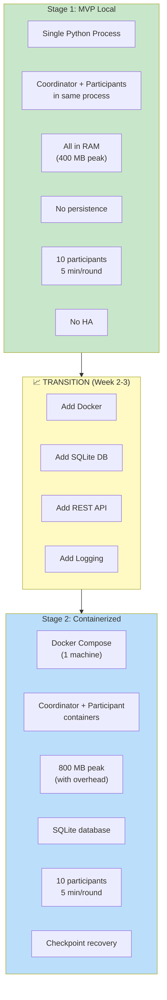
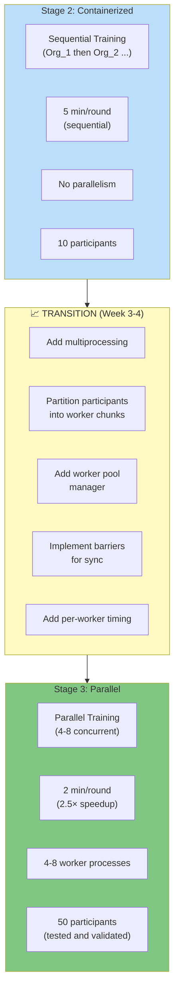
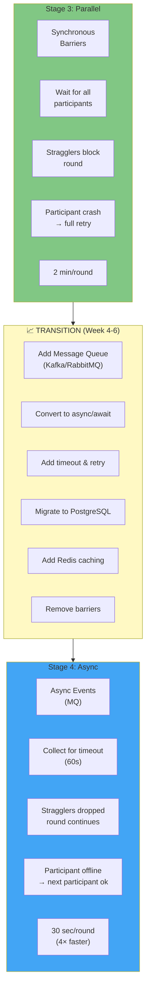
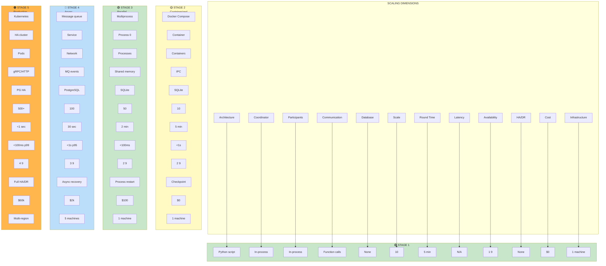
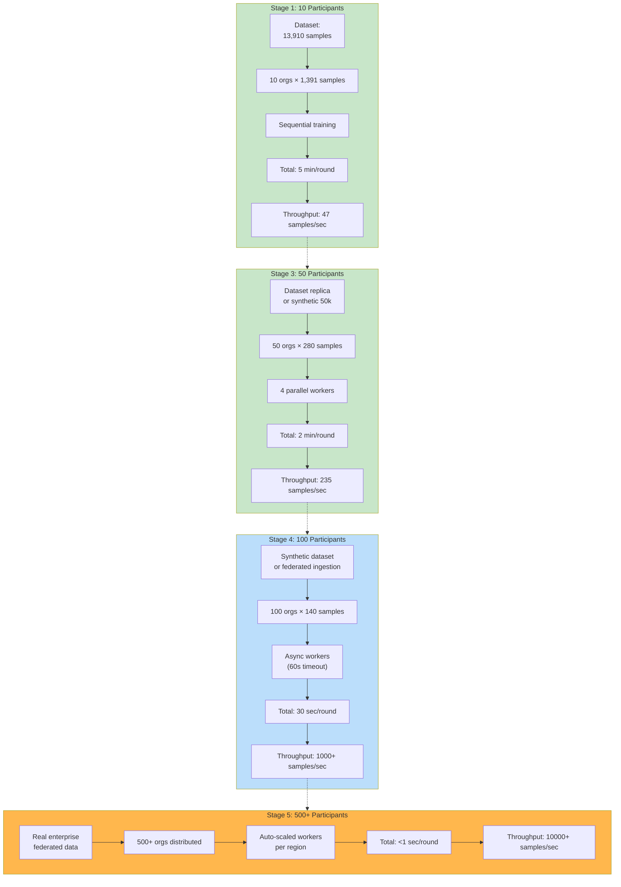

# Scaling Architecture
## Protector Uttam: Aggregation and Multi-Stage Scaling

**Document Type:** Scaling Strategy & Production Architecture  
**Version:** 1.0  
**Date:** 2024  
**Diagrams:** Aggregation pipeline and 5-stage scaling architecture  

---

## 1. Safe Aggregation Pipeline

Detailed flow of filtering decisions, aggregating trusted updates, and updating global model:

```mermaid
graph TD
    subgraph COLLECT["📦 DECISION COLLECTION"]
        R1["Org_1: ALLOW<br/>Trust 92"]
        R2["Org_2: ALLOW<br/>Trust 88"]
        R3["Org_3: MONITOR<br/>Trust 70"]
        R4["Org_4: MONITOR<br/>Trust 65"]
        R5["Org_5: REVIEW<br/>Trust 50"]
        R6["Org_6: BLOCK<br/>Trust 35"]
        R7["Org_7-10: ...]
        
        STATS["Statistics:<br/>- ALLOW: 2<br/>- MONITOR: 2<br/>- REVIEW: 1<br/>- BLOCK: 1"]
    end
    
    subgraph POLICY["🎯 AGGREGATION POLICY"]
        DEFAULT["Default Policy:<br/>Use ALLOW only"]
        ALTERNATIVE["Alternative Policy:<br/>Use ALLOW + MONITOR"]
        CHOSEN["Policy Applied<br/>(MVP: ALLOW only)"]
    end
    
    subgraph FILTER["🔍 FILTERING"]
        ALLOW_ONLY["Filter to ALLOW<br/>decisions only"]
        FILTERED["Filtered Set:<br/>Org_1, Org_2<br/>(2 out of 10)"]
        PCT["Participation:<br/>20%"]
    end
    
    subgraph EXTRACT["📊 EXTRACT GRADIENTS"]
        G1["Gradient from Org_1<br/>(128-dim vector)"]
        G2["Gradient from Org_2<br/>(128-dim vector)"]
        STACK["Stack into Matrix:<br/>2 × 128"]
    end
    
    subgraph AVERAGE["∑ FEDERATED AVERAGING"]
        MEAN["Compute Mean<br/>per feature"]
        AGG["Aggregated Gradient<br/>(128-dim)"]
        FORMULA["∆w_agg = (1/K) × Σ ∆w_k<br/>where K = 2 (ALLOW count)"]
    end
    
    subgraph SAFE_CHECK["✅ SAFETY CHECK"]
        MAG_CHECK["Magnitude Check"]
        MAG_VAL["||∆w_agg||"]
        MAG_OK["Within bounds?"]
        CLIP["Optional Clip<br/>if too large"]
    end
    
    subgraph APPLY["🔄 APPLY UPDATE"]
        LR["Learning Rate: α = 0.01"]
        UPDATE_RULE["new_w = old_w - α × ∆w_agg"]
        NEW_MODEL["Updated Global Model"]
    end
    
    subgraph VALIDATE["✅ VALIDATION"]
        CHECK_WEIGHTS["Weights valid<br/>(no NaN/Inf)?"]
        EVAL_TEST["Evaluate on<br/>test set"]
        ACC["New Accuracy"]
        DECISION{"Improvement or<br/>stable?"}
    end
    
    subgraph CHECKPOINT["💾 CHECKPOINT"]
        SAVE_M["Save Model"]
        SAVE_R["Save Round #"]
        SAVE_S["Save Stats"]
        READY["Ready for<br/>Next Round"]
    end
    
    R1 --> STATS
    R2 --> STATS
    R3 --> STATS
    R4 --> STATS
    R5 --> STATS
    R6 --> STATS
    R7 --> STATS
    
    STATS --> CHOSEN
    CHOSEN --> ALLOW_ONLY
    
    ALLOW_ONLY --> FILTERED
    FILTERED --> PCT
    
    FILTERED --> G1
    FILTERED --> G2
    G1 --> STACK
    G2 --> STACK
    
    STACK --> MEAN
    MEAN --> AGG
    AGG --> FORMULA
    FORMULA --> MAG_CHECK
    
    MAG_CHECK --> MAG_VAL
    MAG_VAL --> MAG_OK
    MAG_OK -->|No| CLIP
    MAG_OK -->|Yes| LR
    CLIP --> LR
    
    LR --> UPDATE_RULE
    UPDATE_RULE --> NEW_MODEL
    
    NEW_MODEL --> CHECK_WEIGHTS
    CHECK_WEIGHTS --> EVAL_TEST
    EVAL_TEST --> ACC
    
    ACC --> DECISION
    DECISION -->|Yes| SAVE_M
    DECISION -->|No| ROLLBACK["Rollback"]
    
    ROLLBACK --> READY
    SAVE_M --> SAVE_R
    SAVE_R --> SAVE_S
    SAVE_S --> READY
    
    style COLLECT fill:#e3f2fd
    style POLICY fill:#fff3e0
    style FILTER fill:#f3e5f5
    style EXTRACT fill:#e8f5e9
    style AVERAGE fill:#e0f2f1
    style SAFE_CHECK fill:#ffebee
    style APPLY fill:#e8f5e9
    style VALIDATE fill:#fff3e0
    style CHECKPOINT fill:#c8e6c9
```

---

## 2. Stage 1 → Stage 2: Single Machine to Containerized

Transition from MVP (Stage 1) to production-ready containerization (Stage 2):



---

## 3. Stage 2 → Stage 3: Containerized to Parallel

Transition from containerized (Stage 2) to parallel processing (Stage 3):



---

## 4. Stage 3 → Stage 4: Parallel to Asynchronous

Transition from parallel local processing to async message-driven:



---

## 5. Stage 4 → Stage 5: Async to Distributed

Transition from single-machine async to fully distributed Kubernetes:

```mermaid
graph TB
    subgraph STAGE4["Stage 4: Async (1 Machine)"]
        S4_COORD["Single Coordinator<br/>(process)"]
        S4_PART["Participants:<br/>Processes on same<br/>machine"]
        S4_SCALE["100 participants<br/>(same machine)"]
        S4_TIME["30 sec/round"]
        S4_HA["No HA"]
        S4_ZONES["Single zone"]
    end
    
    subgraph TRANSITION4["📈 TRANSITION (Week 6-10)"]
        T4_1["Set up Kubernetes"]
        T4_2["Containerize services"]
        T4_3["Add service mesh<br/>(Istio)"]
        T4_4["Configure DNS/ingress"]
        T4_5["Add monitoring<br/>(Prometheus)"]
        T4_6["Add logging<br/>(ELK)"]
        T4_7["Add tracing<br/>(Jaeger)"]
        T4_8["Implement HA<br/>coordinators"]
    end
    
    subgraph STAGE5["Stage 5: Distributed K8s"]
        S5_COORD["HA Coordinators<br/>(3 replicas)"]
        S5_PART["Participant Pods<br/>(500+, distributed)"]
        S5_SCALE["500+ participants<br/>(multi-region)"]
        S5_TIME["<1 sec/round<br/>(optimized)"]
        S5_HA["99.99% availability"]
        S5_ZONES["Multi-zone/region"]
    end
    
    STAGE4 --> TRANSITION4
    TRANSITION4 --> STAGE5
    
    style STAGE4 fill:#42a5f5
    style TRANSITION4 fill:#fff9c4
    style STAGE5 fill:#ffb74d
```



---

## 6. Complete Scaling Progression Matrix

Side-by-side comparison of all scaling dimensions:



---

## 7. Data Flow at Scale

How data flows through the system at different participant scales:



---

## 8. Resource Requirements Over Stages

Memory, CPU, and storage needs as system scales:


---

## MVP to Production Checklist

### Before Stage 2

```
MVP Validation:
  ✅ Trust formulas mathematically correct
  ✅ Confidence assessment functional
  ✅ Hard safety gate rejects bad updates
  ✅ Decision logic working (ALLOW/MONITOR/REVIEW/BLOCK)
  ✅ 9 scenarios produce expected outcomes
  ✅ Model improves over rounds
  ✅ No data leakage between participants
  ✅ Edge cases handled (small datasets, imbalance)
  ✅ Audit trail complete
  ✅ Performance within specification (5 min/round)
```

### Before Stage 3

```
Containerization Validation:
  ✅ Persistent database working
  ✅ Checkpoint/restore verified
  ✅ REST API endpoints functional
  ✅ Logging system operational
  ✅ No data loss on container restart
  ✅ Docker compose reproducible
  ✅ Performance still 5 min/round (no regression)
  ✅ Scaling to 20 participants tested
```

### Before Stage 4

```
Parallelization Validation:
  ✅ Multiprocessing pool working
  ✅ Round time < 2.5 min (2.5× speedup achieved)
  ✅ 50 participants tested
  ✅ Memory still < 2GB
  ✅ No race conditions
  ✅ Barrier synchronization working
  ✅ Worker crash recovery tested
```

### Before Stage 5

```
Async/MQ Validation:
  ✅ Message queue operational
  ✅ PostgreSQL failover working
  ✅ Redis caching functional
  ✅ Async timeouts correct
  ✅ Dropout tolerance (up to 40%) validated
  ✅ Round time < 60 seconds
  ✅ 100 participants tested
  ✅ Service mesh (Istio) routing correct
```

### Production Readiness

```
Before Going Live (Stage 5):
  ✅ Kubernetes cluster HA (3+ zones)
  ✅ 99.99% availability demonstrated (24h test)
  ✅ Disaster recovery tested
  ✅ Backup/restore automated
  ✅ Monitoring 24/7
  ✅ On-call rotation established
  ✅ Compliance audit passed
  ✅ Security scanning clean
  ✅ Load testing: 500+ participants validated
  ✅ Cost model accurate (±10%)
```

---

## Key Milestones

| Stage | Duration | Participants | Round Time | Availability | Cost | Completion |
|-------|----------|--------------|-----------|--------------|------|-----------|
| 1 | 2 weeks | 10 | 5 min | 1 9 | $0 | Month 0.5 |
| 2 | +3 weeks | 10 | 5 min | 2 9 | $0 | Month 1 |
| 3 | +2 weeks | 50 | 2 min | 2 9 | $100 | Month 1.5 |
| 4 | +4 weeks | 100 | 30 sec | 3 9 | $2k | Month 2.5 |
| 5 | +10 weeks | 500+ | <1 sec | 4 9 | $60k | Month 4 |

---

## Document History

| Version | Date | Author | Notes |
|---------|------|--------|-------|
| 1.0 | 2024 | Team | Initial scaling architecture |

**End of Scaling Architecture**
