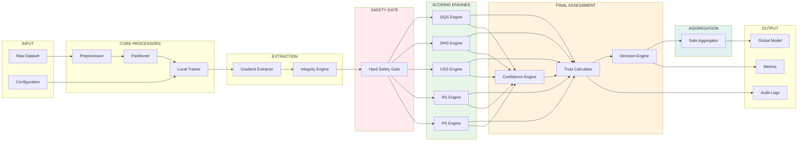
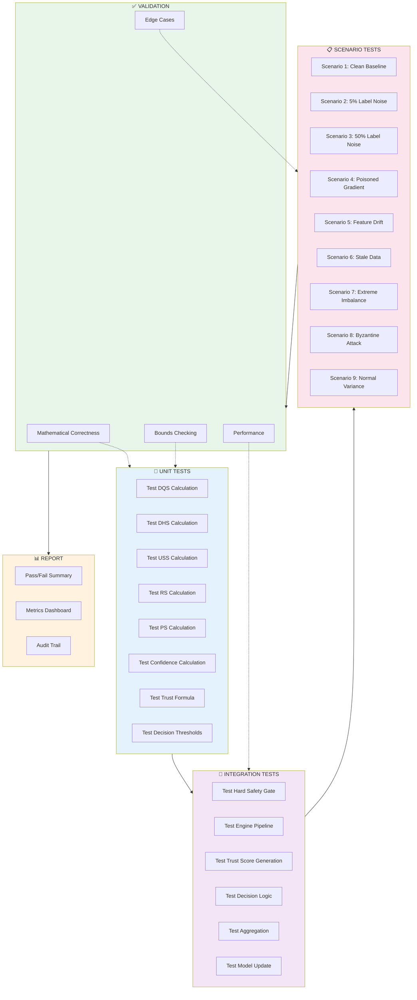
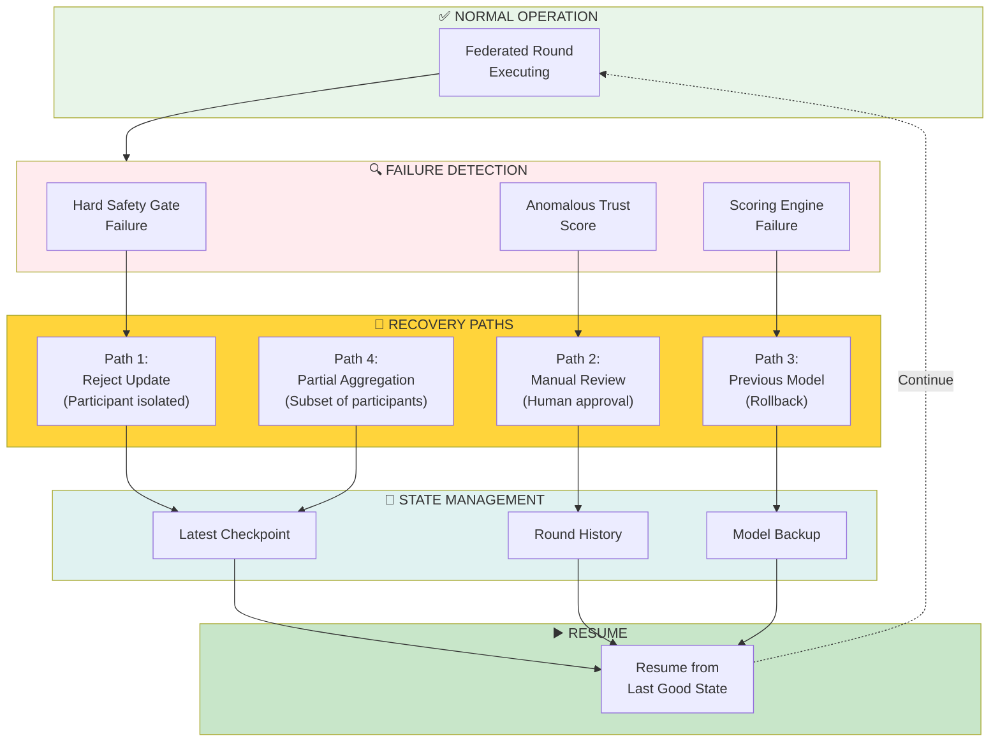

# System Architecture
## Protector Uttam: Core System Design with Mermaid Diagrams

**Document Type:** Technical Architecture Reference  
**Version:** 1.0  
**Date:** 2024  
**Diagrams:** 4 high-level system views  

---

## 1. High-Level System Architecture

The Protector Uttam system is organized into three major layers: **Data & Compute**, **Trust Control**, and **Decision & Aggregation**.

```mermaid
graph TB
    subgraph DATA["📊 DATA & COMPUTE LAYER"]
        DATASET[("Dataset<br/>(13,910 samples)")]
        PREPROC["Preprocessing<br/>(Sparse Format)"]
        PART["Participant<br/>Partitioning<br/>(10 orgs)"]
        
        DATASET --> PREPROC
        PREPROC --> PART
    end
    
    subgraph TRAIN["🔄 FEDERATED TRAINING LAYER"]
        LOCALM["Local Model<br/>Training<br/>(Gradient Boosting)"]
        EXTRACT["Gradient<br/>Extraction"]
        HASH["Gradient Hash<br/>(Integrity)"]
        
        LOCALM --> EXTRACT
        EXTRACT --> HASH
    end
    
    subgraph GATE["🛡️ HARD SAFETY GATE"]
        SAFETY["Structural<br/>Validation"]
        BOUNDS["Magnitude<br/>Bounds"]
        FRESH["Freshness<br/>Check"]
        GATE_OK["Gate Pass/Fail"]
        
        SAFETY --> GATE_OK
        BOUNDS --> GATE_OK
        FRESH --> GATE_OK
    end
    
    subgraph TRUST["📈 TRUST SCORING LAYER"]
        DQS["Data Quality<br/>Score (25%)"]
        DHS["Drift Health<br/>Score (25%)"]
        USS["Update Safety<br/>Score (20%)"]
        RS["Reliability<br/>Score (20%)"]
        PS["Performance<br/>Score (10%)"]
        
        CALC["Trust Calculation<br/>Formula"]
        
        DQS --> CALC
        DHS --> CALC
        USS --> CALC
        RS --> CALC
        PS --> CALC
    end
    
    subgraph CONFIDENCE["🎯 CONFIDENCE LAYER"]
        DC["Data Coverage<br/>(30%)"]
        HC["Historical<br/>Coverage (25%)"]
        MA["Metric<br/>Availability (20%)"]
        EF["Evidence<br/>Freshness (15%)"]
        SS["Statistical<br/>Stability (10%)"]
        
        CONF_CALC["Confidence<br/>Calculation"]
        
        DC --> CONF_CALC
        HC --> CONF_CALC
        MA --> CONF_CALC
        EF --> CONF_CALC
        SS --> CONF_CALC
    end
    
    subgraph DECISION["🚦 DECISION ENGINE"]
        SCORE["Combined<br/>Trust Score"]
        DECISION["Decision Logic<br/>Thresholds"]
        OUTPUT["Decision Output"]
        
        SCORE --> DECISION
        DECISION --> OUTPUT
    end
    
    subgraph AGG["∑ AGGREGATION LAYER"]
        FILTER["Filter By<br/>Decision"]
        AVERAGE["Federated<br/>Average"]
        GLOBAL["Global Model<br/>Update"]
        
        FILTER --> AVERAGE
        AVERAGE --> GLOBAL
    end
    
    PART --> LOCALM
    HASH --> SAFETY
    GATE_OK --> DQS
    GATE_OK --> DHS
    GATE_OK --> USS
    GATE_OK --> RS
    GATE_OK --> PS
    CALC --> DC
    CONF_CALC --> SCORE
    OUTPUT --> FILTER
    GLOBAL -.->|Next Round| PART
    
    style DATA fill:#e1f5ff
    style TRAIN fill:#f3e5f5
    style GATE fill:#ffebee
    style TRUST fill:#e8f5e9
    style CONFIDENCE fill:#fff3e0
    style DECISION fill:#f1f8e9
    style AGG fill:#e0f2f1
```

---

## 2. Complete Main Flow: Data to Global Model

The entire pipeline from raw data to updated global model, showing all 13 critical stages:

```mermaid
graph TD
    A["🔴 START: Raw Dataset<br/>(13,910 samples)"]
    B["📥 STAGE 1: Preprocessing<br/>(Sparse format parsing)"]
    C["👥 STAGE 2: Participant Partitioning<br/>(10 organizations)"]
    D["🏪 STAGE 3: Local Data Distribution<br/>(1,391 samples/org avg)"]
    E["⚙️ STAGE 4: Local Model Training<br/>(Gradient Boosting)"]
    F["📤 STAGE 5: Gradient Extraction<br/>(Local updates)"]
    G["🔐 STAGE 6: Integrity Hashing<br/>(SHA256)"]
    H["🛡️ STAGE 7: Hard Safety Gate<br/>(Structural validation)"]
    I["📊 STAGE 8: Data Quality Engine<br/>(Schema, completeness, outliers)"]
    J["📈 STAGE 9: Drift Engine<br/>(PSI-based distribution shift)"]
    K["🔄 STAGE 10: Update Safety Engine<br/>(Magnitude, validity, freshness)"]
    L["💓 STAGE 11: Reliability Engine<br/>(Heartbeat, availability, success)"]
    M["🎯 STAGE 12: Performance Engine<br/>(Metrics, fairness, model delta)"]
    N["🎲 STAGE 13: Confidence Assessment<br/>(5-component calculation)"]
    O["📊 STAGE 14: Trust Score Calculation<br/>(5-dimension formula)"]
    P["🚦 STAGE 15: Decision Engine<br/>(ALLOW/MONITOR/REVIEW/BLOCK)"]
    Q["∑ STAGE 16: Safe Aggregation<br/>(Federated averaging)"]
    R["🌍 STAGE 17: Global Model Update<br/>(New weights)"]
    S["🟢 END: Ready for Next Round"]
    
    A --> B
    B --> C
    C --> D
    D --> E
    E --> F
    F --> G
    G --> H
    H -->|Safety Pass| I
    H -->|Safety Fail| REJECT1["❌ REJECT:<br/>Critical structure issue"]
    I --> J
    J --> K
    K --> L
    L --> M
    M --> N
    N --> O
    O --> P
    P -->|ALLOW| Q
    P -->|MONITOR| FALLBACK1["⚠️ FALLBACK:<br/>Use with caution"]
    P -->|REVIEW| FALLBACK2["⚠️ FALLBACK:<br/>Manual review"]
    P -->|BLOCK| FALLBACK3["🚫 BLOCK:<br/>Reject update"]
    Q --> R
    R --> S
    
    FALLBACK1 --> Q
    FALLBACK2 --> MANUAL["Manual Decision"]
    FALLBACK3 --> REJECT2["❌ REJECT<br/>Update"]
    MANUAL --> Q
    
    style A fill:#ff6b6b
    style S fill:#51cf66
    style REJECT1 fill:#ff6b6b
    style REJECT2 fill:#ff6b6b
    style FALLBACK1 fill:#ffd43b
    style FALLBACK2 fill:#ffd43b
    style FALLBACK3 fill:#ff6b6b
    style H fill:#ffebee
    style I fill:#e8f5e9
    style J fill:#e8f5e9
    style K fill:#e8f5e9
    style L fill:#e8f5e9
    style M fill:#e8f5e9
    style N fill:#fff3e0
    style O fill:#fff3e0
    style P fill:#f1f8e9
    style Q fill:#e0f2f1
    style R fill:#e0f2f1
```



---

## 3. System Component Dependencies

Shows how all components interact and depend on each other:



---

## 4. Testing & Validation Architecture

Complete architecture for verifying all system components:



---

## 5. Recovery & Resilience Architecture

System recovery paths and fallback mechanisms:



---

## MVP System Constraints

### Explicit Limitations (24 total)

**Communication:**
- Synchronous blocking only (no async events)
- Single machine (no real networking)
- Function calls, not RPC
- No retry logic (failure = restart)

**Trust Scoring:**
- 5 fixed dimensions (not customizable)
- Linear weighted formula (not ML-based)
- No feedback loop (trust score not updated by outcomes)
- No participant-specific weighting

**Participant Management:**
- Fixed 10 participants (hardcoded)
- No dynamic addition/removal
- No participant recovery
- No geographic distribution

**Model & Data:**
- Gradient Boosting only
- LibSVM format only
- In-memory (no persistence)
- Single dataset (no streaming)

**Storage:**
- All data in RAM
- No checkpointing
- No audit logs
- Restart loses state

**Performance:**
- Sequential processing
- 5-minute rounds (not optimized)
- No caching
- No parallel training

---

## Production Readiness Checklist

**After MVP, verify before Stage 2:**

- [ ] Trust score formulas produce mathematically correct results
- [ ] Confidence assessment accurately predicts update quality
- [ ] Decision logic (ALLOW/MONITOR/REVIEW/BLOCK) works as specified
- [ ] All 9 scenarios produce expected outcomes
- [ ] Hard Safety Gate rejects bad updates
- [ ] Federated averaging improves global model
- [ ] Edge cases (small data, imbalanced classes) handled
- [ ] No data leakage between participants
- [ ] Round times consistent with specification
- [ ] System recovers from participant failures

---

## System Guarantees

### What MVP Guarantees

✅ **Correctness Guarantees:**
- Each engine computes per specification (no approximations)
- All 5 trust dimensions included in score
- All 5 confidence components included in assessment
- Decision thresholds applied deterministically
- Aggregation uses federated averaging (not majority voting)

✅ **Safety Guarantees:**
- Hard Safety Gate rejects structurally invalid updates
- Trust score determines inclusion/exclusion
- BLOCK decision blocks malicious updates (trust < 40)
- No update with BLOCK decision affects global model

✅ **Testing Guarantees:**
- 9 scenarios verify edge cases
- Mathematical validation ensures formula correctness
- Bounds checking prevents arithmetic errors
- Audit trail logs all decisions

### What MVP Does NOT Guarantee

❌ **No Performance Guarantees:**
- 5-minute rounds is baseline, not SLA
- No latency bounds in MVP
- Sequential processing not optimized

❌ **No Availability Guarantees:**
- Single machine (no redundancy)
- No crash recovery
- No HA/DR

❌ **No Security Guarantees:**
- No encryption (MVP on trusted network)
- No authentication (single user)
- No audit logging to external system

---

## Document History

| Version | Date | Author | Notes |
|---------|------|--------|-------|
| 1.0 | 2024 | Team | Initial MVP architecture |

**End of System Architecture**
